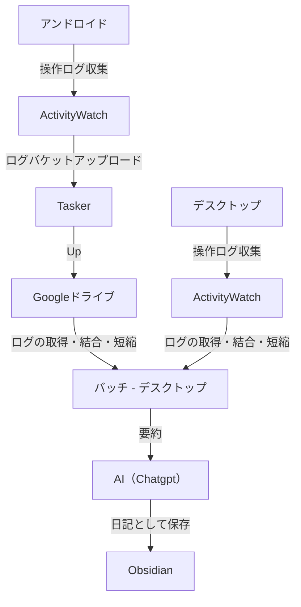

# activity-watch-log-2-diary

[ActivityWatch](https://activitywatch.net/) のログをAI使って日記に変換するプロジェクト

## 構成メモ

## 要素

- プログラムとActivityWatchを操作してプロンプトを生成するバッチ
- AIに食わせるためにログをスリムにするプログラム
- スリム化したログを元に日記を作るプロンプトのテンプレート
- GoogleドライブからAndroidのログバケットを取得しActivityWatchにエクスポートする機能
- (将来的に) 生成したプロンプトをAIに渡して日記に変換して格納するプログラム
- (将来的に) この処理を定期的に実行するタイマー処理（Cron？Windowsスケジューラー？スタートアップでバッチ起動？）

## 備考

AIで作ってるので可読性は皆無です

主にコードのバージョン履歴管理がメインです

